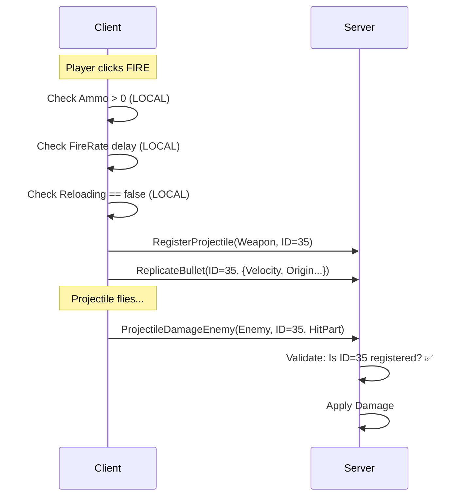
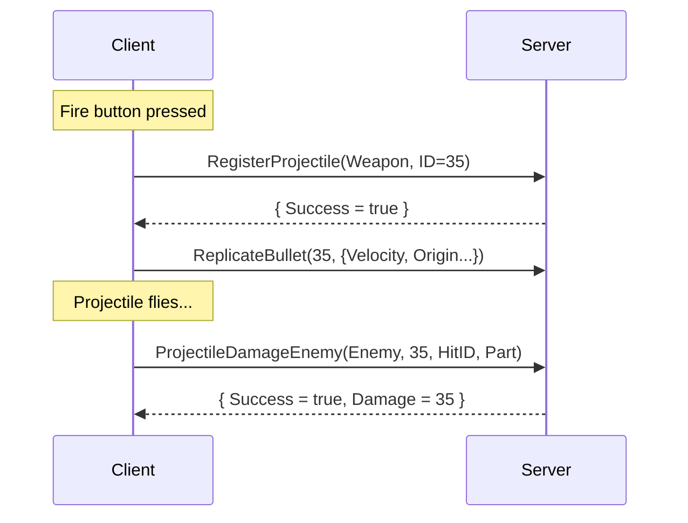

# ThrownWeapon Exploit Analysis - Complete Documentation

> **Game:** 99 Nights In The Forest  
> **Target:** `ModuleScript.ThrownWeapon` (Crossbow, Throwing Knives, etc.)  
> **Analysis Date:** 2026-02-03  

---

## 1. Architecture Overview



**Key Insight:** Server tracks projectiles by **ID**, not by ammo count per-shot.

---

## 2. Script Analysis (`ThrownWeapon.Source.txt`)

### 2.1 Local Variables (Exploitable)

| Variable | Default | Location | Purpose |
|----------|---------|----------|---------|
| `MagazineSize` | 1 | Line 3 | Max ammo per reload |
| `ProjectileSpeed` | 80 | Line 4 | Bullet velocity |
| `ProjectileGravity` | 35 | Line 5 | Bullet drop |
| `FireRate` | 0.2 | Line 10 | Delay between shots |
| `Reloading` | false | Line 22 | Reload lock flag |
| `LastFired` | 0 | Line 21 | Timestamp of last shot |

### 2.2 Critical Local Checks (Line 46-62)

```lua
-- These are ALL client-side, can be bypassed:
if arg1.Reloading then return end                    -- Check 1
if time() < ReloadFinishTime then return end         -- Check 2
if arg1.RealModel:GetAttribute("ServerReloading") then return end  -- Check 3
if arg1.Ammo <= 0 then ... return end                -- Check 4
if time() < arg1.LastFired + arg1.FireRate then return end  -- Check 5
```

### 2.3 Server Communication (RemoteSpy Confirmed)

| Remote | Type | Purpose |
|--------|------|---------|
| `RegisterProjectile` | InvokeServer | Tell server "I'm creating projectile #N" |
| `ReplicateBullet` | FireServer | Sync bullet visuals to other players |
| `ProjectileDamageEnemy` | InvokeServer | Request damage when bullet hits |
| `RequestReloadFirearm` | InvokeServer | Ask server for more ammo |

---

## 3. Exploit Strategies

### 3.1 Strategy A: Rapid Fire / No Reload ✅ WORKS

**Target:** Weapons with Unlimited Ammo but slow reload (Crossbow)

**Method:**
1. Force `FireRate = 0` (no cooldown)
2. Force `Reloading = false` (never locked)
3. Delete `ReloadFinishTime` attribute every frame
4. Result: Machine gun crossbow

```lua
weapon.FireRate = 0
weapon.ReloadTime = 0
weapon.Reloading = false
weapon.RealModel:SetAttribute("ReloadFinishTime", nil)
```

### 3.2 Strategy B: Infinite Ammo ⚠️ RISKY

**Target:** Weapons with limited ammo

**Method:**
1. Hook `__index` metatable to return `Ammo = 999`
2. Local fire check passes
3. `ProjectileClass.new()` runs and generates valid ID
4. Server accepts because ID sequence is valid

**Risk:** Server *might* track ammo independently and reject damage.

### 3.3 Strategy C: Super Projectile ✅ SAFE

**Target:** All projectile weapons

**Method:**
1. Set `ProjectileSpeed = 99999` (instant hit)
2. Set `ProjectileGravity = 0` (laser straight)
3. Set `ProjectileRadius = 15` (giant hitbox)

**Why Safe:** Physics are client-authoritative. Server trusts hit reports.

---

## 4. RemoteSpy Log Evidence

From `2026-02-03T04_58_10Z_clean.lua`:

```lua
-- Sequence shows rapid ID increments (34→35→36→...)
RegisterProjectile:InvokeServer(Crossbow, 34)
ReplicateBullet:FireServer("FireAllClients", 34, {...})
RegisterProjectile:InvokeServer(Crossbow, 35)  -- Rapid succession OK
ReplicateBullet:FireServer("FireAllClients", 35, {...})
ProjectileDamageEnemy:InvokeServer(Enemy, 35, "1_8401342884", Body)  -- Damage accepted

-- Reload only called ONCE when ammo depletes
RequestReloadFirearm:InvokeServer(Crossbow)
```

**Conclusion:** Server accepts any valid ID sequence. No per-shot ammo validation visible.

---

## 5. Implementation Files

| File | Purpose |
|------|---------|
| `Exploit_NoReload.lua` | Rapid fire for unlimited ammo weapons |
| `Exploit_ThrownWeapon.lua` | Full package: ammo + physics + fire rate |

---

## 6. Risk Assessment

| Exploit | Detection Risk | Effectiveness |
|---------|----------------|---------------|
| Rapid Fire | ⚠️ Medium (rate limiting possible) | ✅ High |
| Infinite Ammo | ⚠️ Medium (server may track) | ✅ High |
| Super Projectile | ✅ Low (client physics trusted) | ✅ Very High |

---

## 7. Quick Reference

**To enable Rapid Fire on Crossbow:**
```lua
local weapon = require(game.Players.LocalPlayer.PlayerScripts.Client).InventoryHandler.CurrentWeapon
weapon.FireRate = 0
weapon.ReloadTime = 0
task.spawn(function()
    while weapon.Equipped do
        weapon.Reloading = false
        weapon.RealModel:SetAttribute("ReloadFinishTime", nil)
        game:GetService("RunService").Heartbeat:Wait()
    end
end)
```

---

## 8. Deep Codebase Analysis

### 8.1 Existing Script Patterns (KillAura.lua)

The project already has a working melee auto-attack system. Key patterns:

| Pattern | Implementation | Location |
|---------|---------------|----------|
| **Weapon Detection** | `ToolHandle.OriginalItem.Value` | `KillAura.lua:56-67` |
| **Hit ID Generation** | `counter_userId` format | `KillAura.lua:70-73` |
| **Target Scanning** | `Characters` + `Items` folders | `KillAura.lua:82-85` |
| **Remote Wrapper** | `Remote.ToolDamageObject()` | `RemoteHandler.lua:126-129` |
| **State Management** | `State.Enabled`, `State.Thread` | Standard module pattern |

### 8.2 Remote Handler API (RemoteHandler.lua)

Complete mapping of remote functions:

#### Melee Combat
```lua
Remote.ToolDamageObject(target, weapon, hitId, cframe)
-- InvokeServer → Returns { Success = true/false }
```

#### Ranged Combat (Projectile Sequence)
```lua
-- Step 1: Register projectile with server
Remote.RegisterProjectile(weapon, projectileId)
-- InvokeServer → Returns { Success = true/false }

-- Step 2: Sync visuals to other players  
Remote.ReplicateBullet(projectileId, bulletData)
-- FireServer (no return)
-- bulletData = { ProjectileGravity, HeadPos, Origin, Velocity, ProjectileName }

-- Step 3: Request damage when projectile hits
Remote.ProjectileDamageEnemy(target, projectileId, hitId, hitPart)
-- InvokeServer → Returns damage result
```

#### AOE/Explosive Combat
```lua
Remote.ExplosiveProjectileDamageEnemy(targets, projectileId, hitId, explosionPos)
-- targets = { {Model = enemy, Distance = float}, ... }
```

### 8.3 Comparison: Melee vs Ranged

| Aspect | Melee (KillAura) | Ranged (ThrownWeapon) |
|--------|------------------|----------------------|
| **Fire Pattern** | Instant `ToolDamageObject` | 3-step sequence |
| **ID System** | `hitCounter_userId` | `projectileId` (sequential int) |
| **Validation** | Per-hit server check | Per-projectile register |
| **Travel Time** | None | Has flight physics |
| **Ammo** | None | Server-tracked |

### 8.4 Critical Insight: Ranged Fire Sequence

From RemoteSpy logs and code analysis, the REQUIRED sequence is:



**Key Observations:**
1. `RegisterProjectile` MUST be called BEFORE damage
2. `ReplicateBullet` syncs visuals (optional for damage, but good for anti-kick)
3. `ProjectileDamageEnemy` uses SAME `projectileId` from step 1
4. Server validates: "Did this player register projectile #35?"

### 8.5 Exploit Implications

**Why the NO_RELOAD exploit works:**
1. Client calls `RegisterProjectile(ID=N)` → Server accepts
2. Client calls `ProjectileDamageEnemy(ID=N)` → Server says "Yes, ID=N was registered"
3. Server DOES NOT check: "Does player have ammo?" at Step 1
4. Server only checks: "Is ID sequence valid?"

**What we bypass:**
- `Ammo <= 0` check (Line 55) → Local bypass
- `ReloadFinishTime` attribute → Delete every frame
- `Reloading` flag → Force false

**What remains intact:**
- `RegisterProjectile` → Still called (ID still generated)
- `ReplicateBullet` → Still called (visuals sync)
- `ProjectileDamageEnemy` → Still called with valid ID
